<p align="center">
  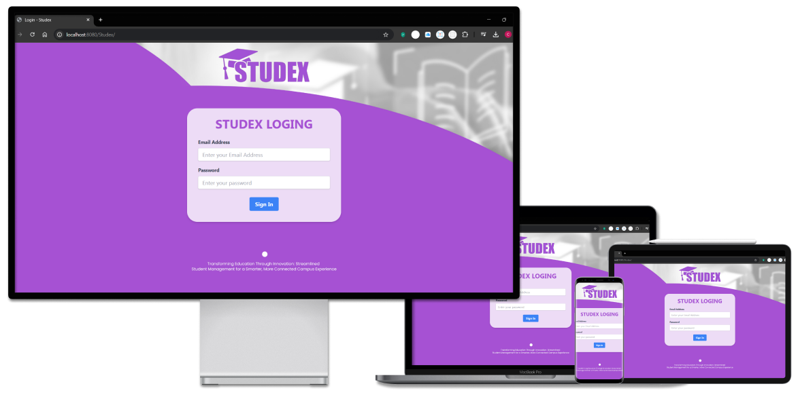
</p>

<h1 align="center">Student Information System</h1>

Studex is a comprehensive student information system developed using **NetBeans**, **HTML**, **Tailwind CSS**, **JSP**, **GlassFish**, and **SQL** technologies. This application helps manage user accounts, classes, subjects, attendance, grades, and student performance efficiently.

---

## Features

### Admin

- **Manage User Accounts and Information:** Create, update, and delete user accounts for students and teachers.
- **Assign and Manage Classes:** Assign students to classes, and manage class details.
- **Assign and Manage Subjects to Teachers:** Allocate specific subjects to teachers, enabling organized classes.
- **View Student Information:** Access detailed student profiles for administration purposes.
- **Review Student Performance:** Monitor student academic performance and progress.
- **Manage Class Attendance:** Track attendance records for all enrolled students, supporting attendance management.
- **View and Enter Grades:** Enter, update, and manage grades for all students in the system.

### Teacher

- **View Student Information:** Access information relevant to students under their supervision, facilitating personalized support.
- **Manage Class Attendance:** Record and monitor attendance for assigned classes.
- **Manage Student Information:** Maintain and update information related to students.
- **View and Enter Grades:** Assess student performance and record grades for assigned classes or subjects.
- **Review Student Performance:** Evaluate and provide feedback on student progress based on performance data.

### Student

- **Login and Account Management:** Access secure login and manage account password.
- **View Personal Information:** Check and update personal information.
- **View Enrolled Classes and Subject Grades:** Review enrollment details and grades for each subject.

---

## Getting Started

### Prerequisites

- [NetBeans IDE](https://netbeans.apache.org/)
- [GlassFish Server](https://javaee.github.io/glassfish/)
- [MySQL](https://www.mysql.com/)

### Installation

1. Clone the repository:
    ```sh
    git clone https://github.com/shashinherath/Studex.git
    ```
2. Open the project in NetBeans IDE.
3. Set up the GlassFish server and MySQL database.
4. Import the `studex_db.sql` file located in the `resources` folder to set up the database:
    ```sh
    mysql -u username -p studex_db < resources/studex_db.sql
    ```
5. Update the database configuration in the project to match your MySQL setup.

### Development

1. Start the GlassFish server.
2. Deploy the application from NetBeans IDE.
3. Access the application through your browser.

### Build

Build the project using NetBeans build tools and deploy the WAR file on the GlassFish server.

### References

- [NetBeans Documentation](https://netbeans.apache.org/kb/docs/)
- [GlassFish Documentation](https://javaee.github.io/glassfish/documentation/)
- [Tailwind CSS Documentation](https://tailwindcss.com/docs)
- [JSP Tutorial](https://www.javatpoint.com/jsp-tutorial)
- [MySQL Documentation](https://dev.mysql.com/doc/)
  
---

### Screenshots

Here are some interface screenshots of the application:
<h3>Admin:<h3>
<p align="center">
  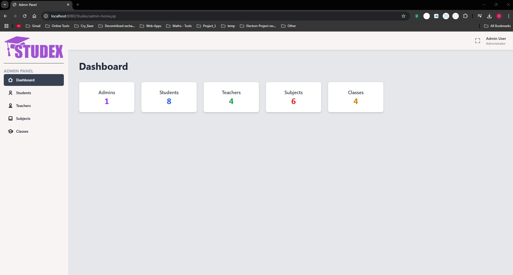
  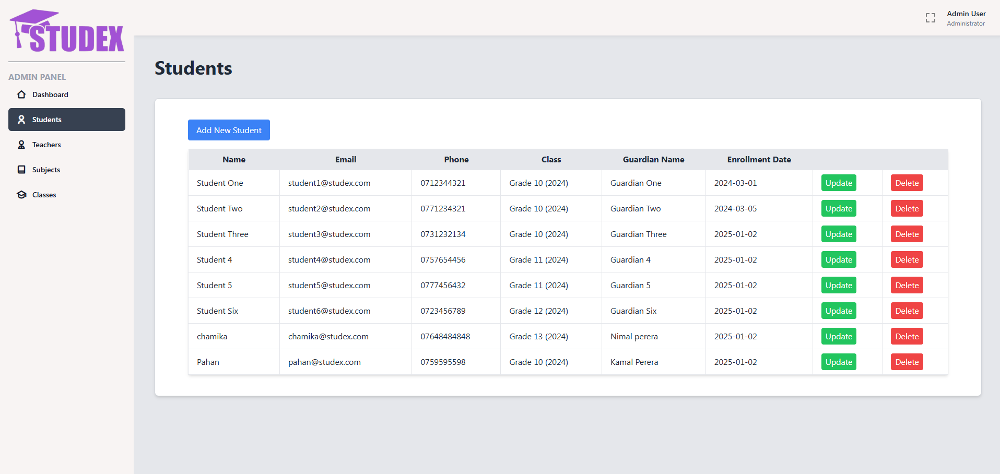
  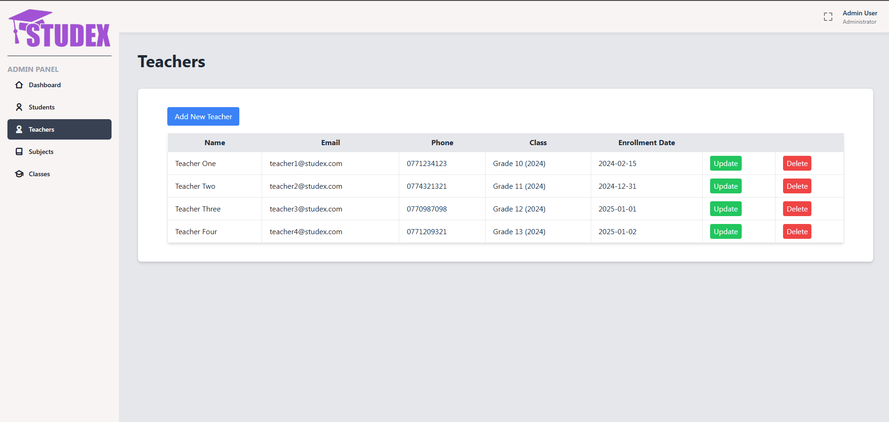
  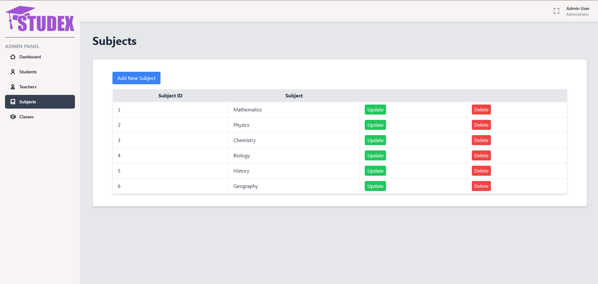
  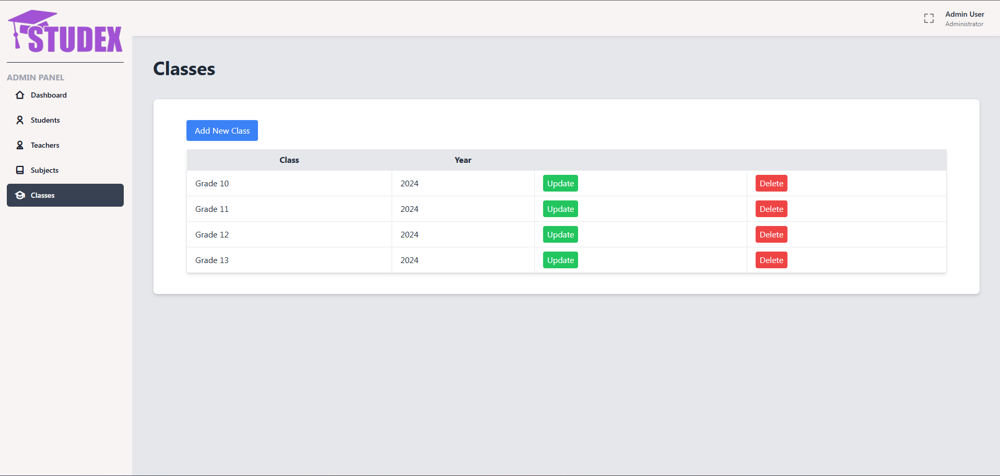
</p>
  
<h3>Teacher:<h3>
<p align="center">
  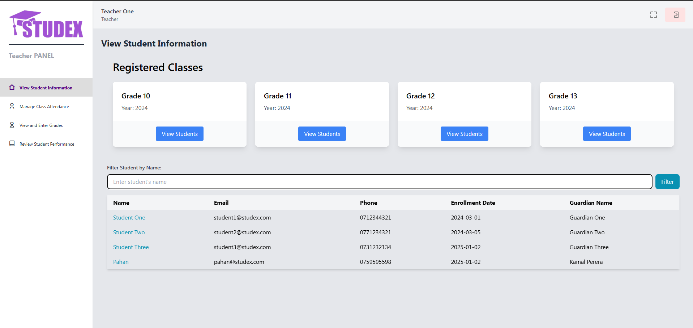
  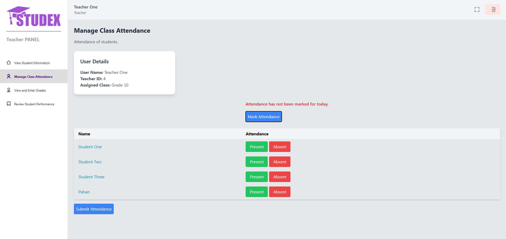
  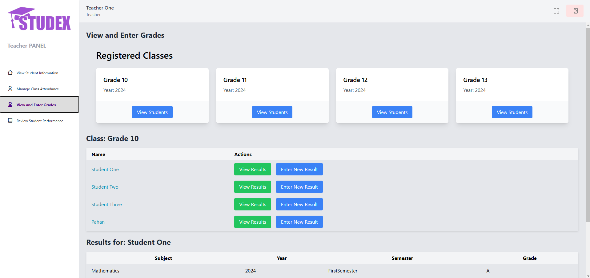
  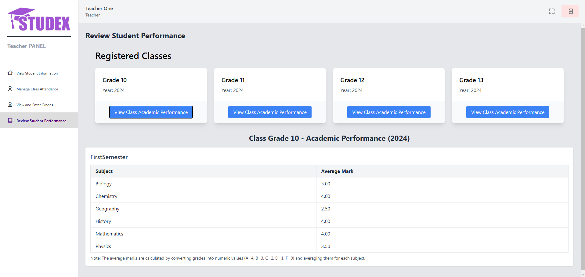
</p>
  
<h3>Student:<h3>
<p align="center">
  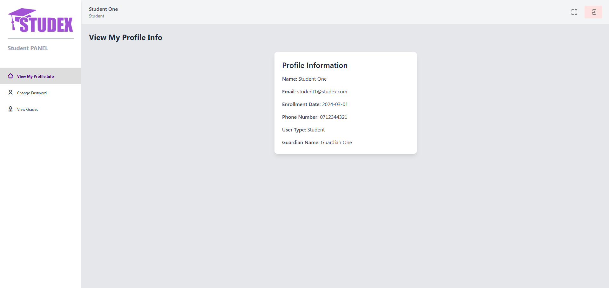
  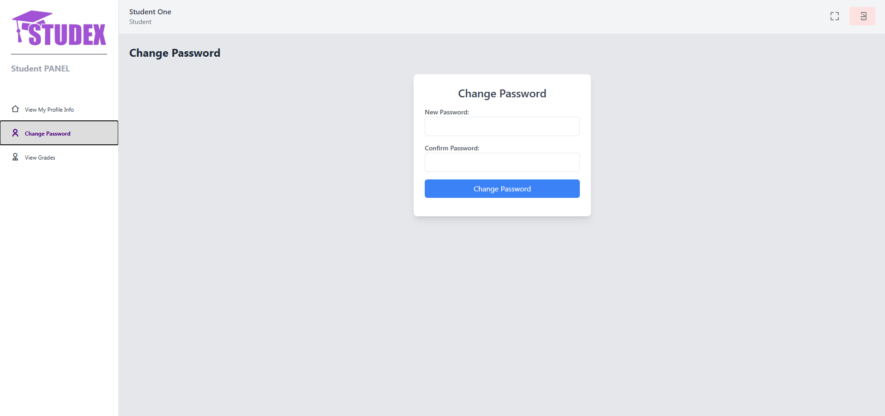
  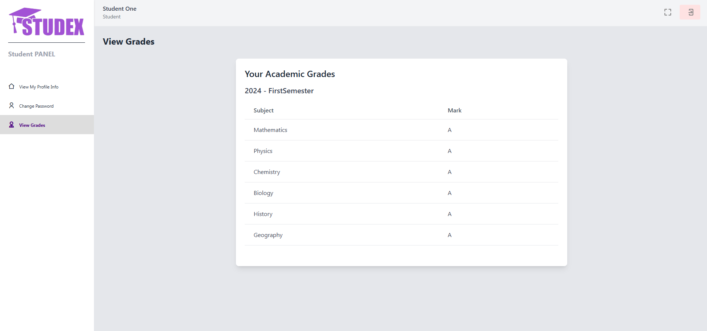
</p>
